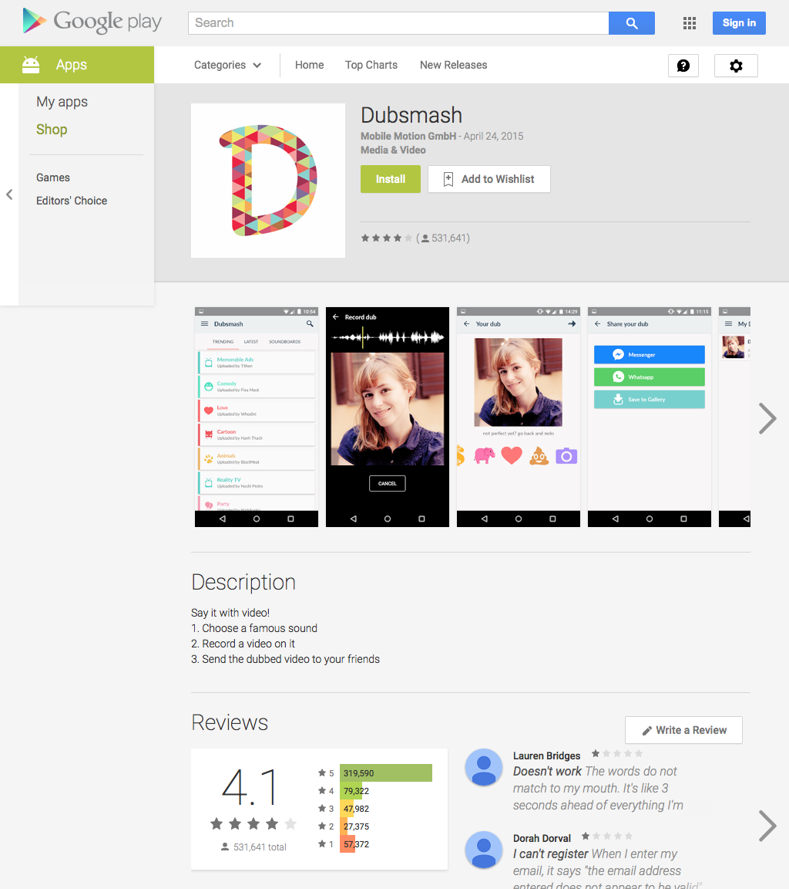
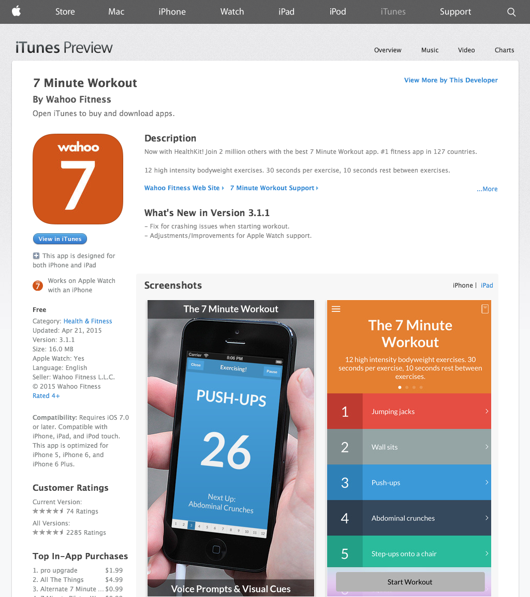
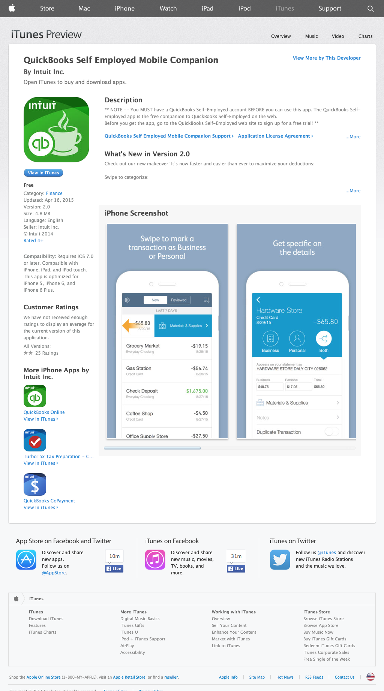
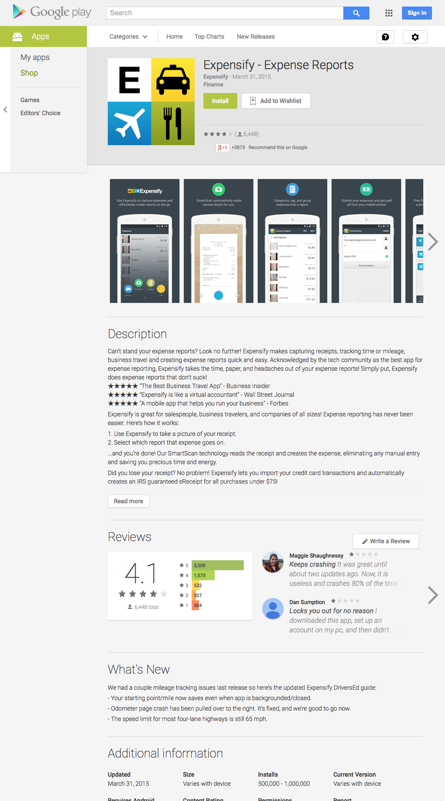
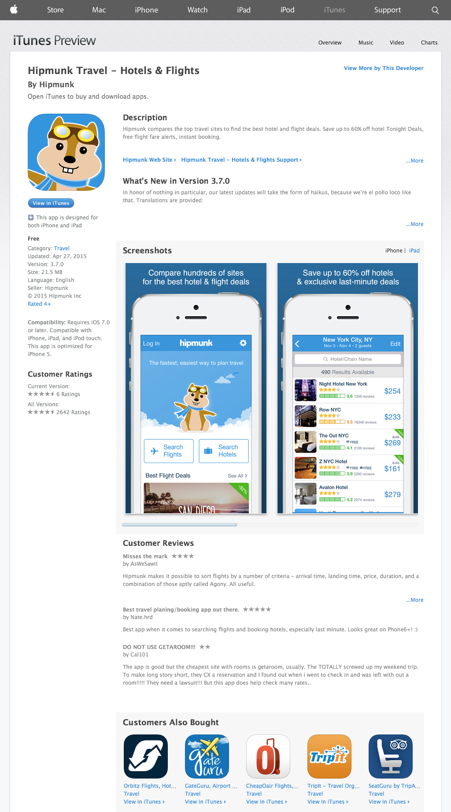
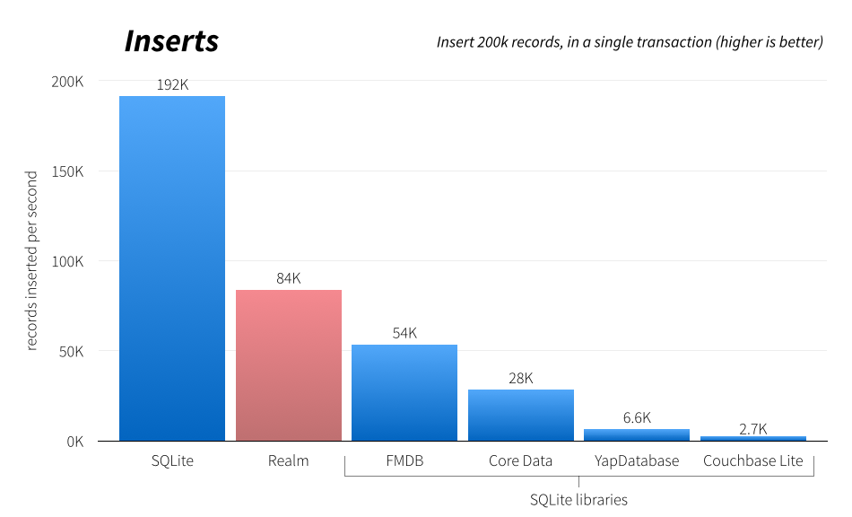
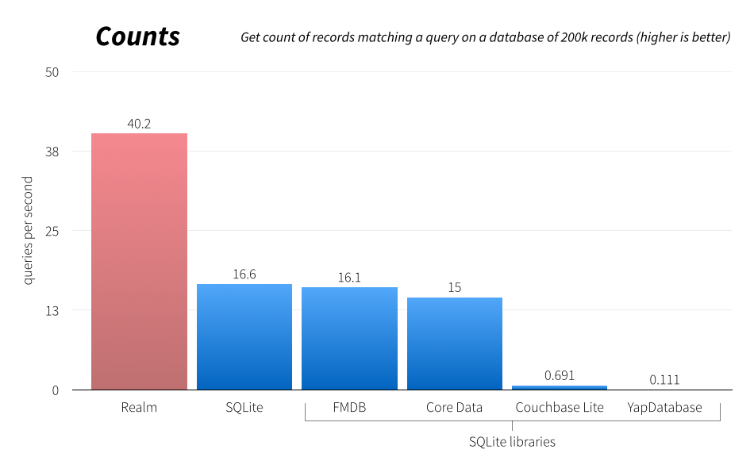
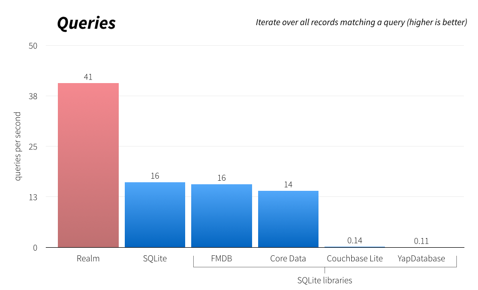

# **Realm**
### PLACE<br>DATE

---
 
Here is the outline of my talk:

1. What is Realm?
2. Who is using Realm?
3. What does Realm look like?
4. Why _not_ use Realm?
5. Why use Realm?

---

# 1. What is Realm?

---

- Realm is a Mobile Database:  
  a replacement for Core Data or SQLite
- **_NOT_** an ORM, **_NOT_** based on SQLite
  no copying between DB & object, no impendance mismatch
- Full database (columns/rows/queries), not a Key-Value store
- In development since 2011, in production since 2012, public since 2014.
- Available for Objective-C, Java & Swift. JS, .Net, C++ coming soon
- Apache 2.0 bindings, C++ core open-source soon

---


---

# 2. Who is using Realm?

---

# **Groupon**
### >100M users!


---

# **Dubsmash**
### iOS & Android
### #1 app overall in >40 countries
### >10M Android installs



---

# Wahoo
### #1 fitness app in >120 countries



---





---

# Less than a year after we launched

- #1-app store apps, large Enterprise companies (Rite Aid, SAP, …), Banks, Healthcare Providers, Device manufacturers…
- Running on _**hundreds of millions**_ of devices already (2nd-most deployed DB in the world)
- >75 physical events about Realm around the world
- >100 articles about Realm online
- Hundreds of questions on StackOverflow
- Hundreds of projects on Github

---

# 3. What does Realm Look Like?

---

## **Models** Objective-C

```objc
@interface Dog : RLMObject
@property NSString *name;
@property NSInteger age;
@end

Dog *mydog = [[Dog alloc] init];

mydog.name = @"Rex"; 
NSLog(@"Name of dog: %@", mydog.name);
```

---

## **Models** Swift

```swift
class Dog: Object {
    dynamic var name = ""
    dynamic var age = 0
}

let mydog = Dog()

mydog.name = "Rex"
println("name of dog: \(mydog.name)")
```

---

## **Models** Java

```java
// Just extend your standard POJO from RealmObject:

public class Dog extends RealmObject {
    private String          name;
    private int             age;
    @ignored private int    dontPersistMe;

    // + Standard setters and getters here
}
```

---

## **Writes** Objective-C

```objc
RLMRealm *realm = [RLMRealm defaultRealm];

[realm transactionWithBlock:^{
    [realm addObject:mydog];
}];
```

---

## **Writes** Swift

```swift
let realm = Realm()

realm.write {
    realm.add(mydog)
}
```

---

## **Writes** Java

```java
Realm realm = Realm.getInstance(this.getContext());

// Transactions give you easy thread-safety
realm.beginTransaction();
Dog dog = realm.createObject(Dog.class);
dog.setName("Rex");
dog.setAge(3);
realm.commitTransaction();
```

---

## **Queries** Objective-C

```objc
RLMResults *r = [Dog objectsWhere:@"age > 8"];
 
// Queries are chainable
r = [r objectsWhere:@"name contains 'rex'"];
```

---

## **Queries** Swift

```swift
let r = Realm().objects(Dog).filter("age > 8")

// Queries are chainable
let r2 = r.filter("name contains 'rex'")



RLMResults *r = [Dog objectsWhere:@"age > 8"];
 
// Queries are chainable
r = [r objectsWhere:@"name contains 'rex'"];
```


---

## **Queries** Java

```java
// Queries uses Builder pattern to build up the query conditions
RealmResults<Dog> query = realm.where(Dog.class)
                               .greaterThan("age", 8)
                               .findAll();

// Queries are chainable
RealmResults<Dog> allRex = query.where()
                                .contains("name", "rex")
                                .findAll();
```

---

## **Relationships** Objective-C

```objc
@interface Person : RLMObject
@property NSString      *name;
@property NSData        *picture;
@property RLMArray<Dog> *dogs;
@end

[realm transactionWithBlock:^{
    RLMPerson *person = [[RLMPerson alloc] init];
    person.name = @"Tim";
    [person.dogs addObject:mydog];
}];
```

---

## **Relationships** Swift

```swift
class Person: Object {
    dynamic var name = ""
    dynamic var picture = NSData()
    let dogs = List<Dog>()
}

realm.write {
    let person = Person()
    person.name = "Tim"
    person.dogs.append(mydog)
}
```


---

## **Relationships** Java

```java
public class Person extends RealmObject {
    private String name;
    private RealmList<Dog> dogs;
}

realm.beginTransaction();
Dog mydog = realm.createObject(Dog.class);
Person person = realm.createObject(Person.class);
person.setName("Tim");
person.getDogs().add(mydog);
realm.commitTransaction();
```

---

## **Threads & Processes** Objective-C

```objc
dispatch_async(dispatch_queue_create("background", 0), ^{
  
  // All Realm instances are thread-confined,
  // but can be easily fetched from any thread
  RLMResults *results = [Dog objectsWhere:@"name contains 'rex'"];

  // You can also write to a Realm from any thread
  // with full ACID guarantees
});

// Also great for Apple Watch & iOS 8 extensions!
```

---

## **Threads & Processes** Swift

```swift
dispatch_async(dispatch_queue_create("background", 0)) {
  // All Realm instances are thread-confined,
  // but can be easily fetched from any thread
  let results = Realm().objects(Dog).filter("name contains 'rex'")

  // You can also write to a Realm from any thread
  // with full ACID guarantees
}

// Also great for Apple Watch & iOS 8 extensions!
```

---

## **Threads & Processes** Java

```java
new Thread(new Runnable() {
    public void run() {
        
        // All Realm instances are thread-confined,
        // but can be easily fetched from any thread
        Realm realm = Realm.getInstance(context);
        RealmResults<Dog> dogs = realm.where(Dog.class)
                                      .contains("name", "rex")
                                      .findAll();
                                      
        // You can also write to a Realm from any thread,
        // with full ACID guarantees
    }
}).start();

// Yes we run *inside* Android Gear devices
// Including stuff like this: zikto.com
```

---

## **Encryption** Objective-C

```objc
// Generate a random encryption key
NSMutableData *key = [NSMutableData dataWithLength:64];
SecRandomCopyBytes( kSecRandomDefault,
                    key.length,
                    (uint8_t *)key.mutableBytes );

// Open the encrypted Realm file
NSError *error;
RLMRealm *realm = [RLMRealm realmWithPath:RLMRealm.defaultRealmPath
                                      key:key
                                 readOnly:NO
                                    error:&error];
```

---

## **Encryption** Swift

```swift
/ Generate a random encryption key
let key = NSMutableData(length: 64)!
SecRandomCopyBytes(kSecRandomDefault, UInt(key.length),
    UnsafeMutablePointer<UInt8>(key.mutableBytes))

// Open the encrypted Realm file
var error: NSError?
let realm = Realm(path: Realm.defaultPath,
    readOnly: false, encryptionKey: key, readOnly: false, error: &error)
```

---

## **Encryption** Java

```java
// Generate a random encryption key
byte[] key = new byte[64];
new Random(365762536).nextBytes(key);

// Open the Realm with encryption enabled
realm = Realm.getInstance(this, key);
```

---

# 4. Why _not_ use Realm?

---

- SQLite is probably one of the most heavily tested open-source pieces of software ever
- Less written materials about Realm so far (but catching up fast)
- Null support (coming this quarter)
- Passing objects across threads (coming this quarter)
- KVO, fine-grained notifications, ReactiveCocoa / RxJava support (coming this quarter)

---

# 5. Why use Realm?

---

- **Easy**: users tell us they get started with Realm in minutes, port their apps in hours & save weeks on each app.

- **Cross-platform**: share Realm files across platforms, use the same high-level models + write similar business logic on both platforms.

- **Supported**: get official answers & quick fixes from the company building your database on Github, StackOverflow or email.

- **Fast** (Not built on SQLite!)
  Optimized for reads. Haven’t optimized writes too much just yet, could beat SQLite…

---



---



---



---

#Q&A


